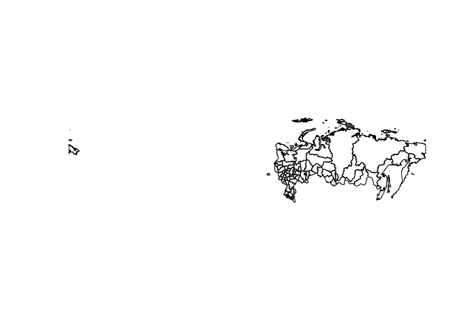
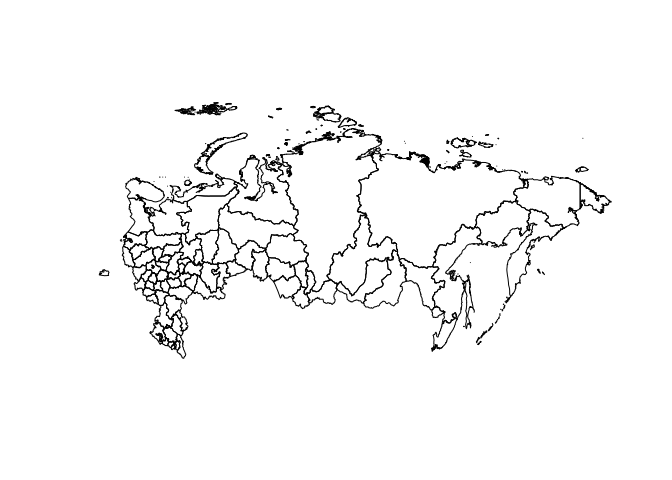
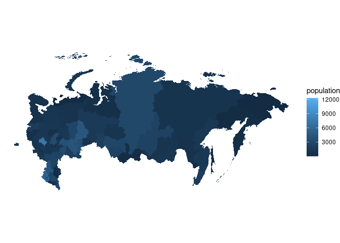
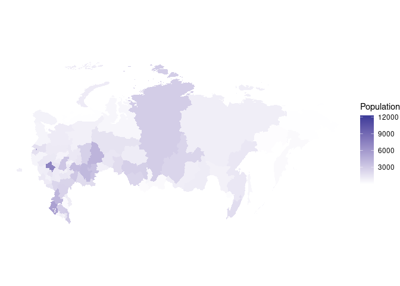
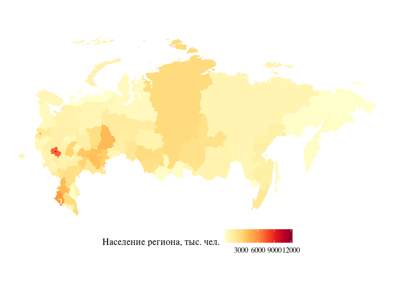
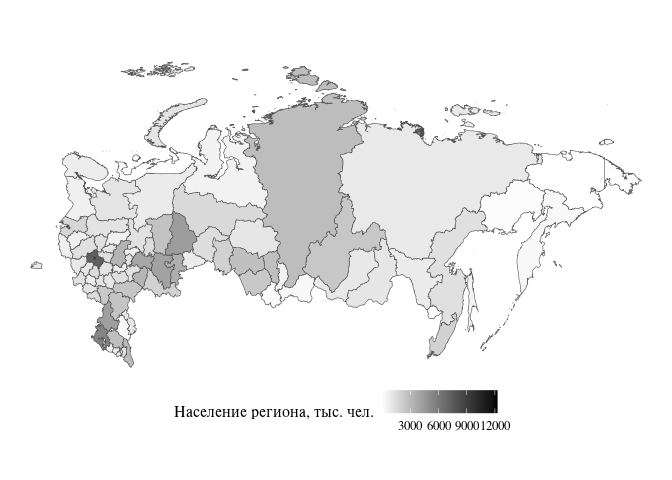

Простая карта России в R
================

В этом коротком примере я показываю, как можно построить простую карту
России с использованием `ggplot2`.

## Загрузка пакетов

Для начала установим и загрузим пакеты, необходимые для
пространственного анализа. В дальнейшем, чтобы не запутаться, я буду
указывать в явном виде, команды из какого пакета я использую.

``` r
library(tidyverse)    # манипуляции с данными и визуализация
library(geodata)      # для доступа к данным о границах
library(sf)           # манипуляции с пространственными объектами
library(RColorBrewer) # цветовые схемы
```

## Пространственные данные

Для осуществления пространственного анализа нам для начала нужны
геоданные. Я буду использовать функцию из пакета `geodata` для доступа к
данным с сайта GADM: <https://gadm.org/data.html> версии 3.6. На самом
сайте есть более новые версии в разных форматах, но я привык к этой.
Подробнее о форматах: <https://gadm.org/formats.html>.

Загрузим геоданные о российских регионах (для уровня регионов указываем
`level = 1`):

``` r
rus_reg_gpkg <- geodata::gadm(country = 'RUS', level = 1, path = tempdir(), version = 3.6)
glimpse(rus_reg_gpkg)
```

    ## S4 class 'SpatVector' [package "terra"]

Перейдем к другому формату, чтобы можно было использовать возможности
пакета `sf`:

``` r
rus_reg_sf <- sf::st_as_sf(rus_reg_gpkg)
glimpse(rus_reg_sf)
```

    ## Rows: 83
    ## Columns: 11
    ## $ GID_0     <chr> "RUS", "RUS", "RUS", "RUS", "RUS", "RUS", "RUS", "RUS", "RUS…
    ## $ NAME_0    <chr> "Russia", "Russia", "Russia", "Russia", "Russia", "Russia", …
    ## $ GID_1     <chr> "RUS.1_1", "RUS.2_1", "RUS.3_1", "RUS.4_1", "RUS.5_1", "RUS.…
    ## $ NAME_1    <chr> "Adygey", "Altay", "Amur", "Arkhangel'sk", "Astrakhan'", "Ba…
    ## $ VARNAME_1 <chr> "Adygea|Adygeya|Adygheya|Republic of Adygeya|Adygeyskaya A.O…
    ## $ NL_NAME_1 <chr> "Республика Адыгея", "Алтайский край", "Амурская область", "…
    ## $ TYPE_1    <chr> "Respublika", "Kray", "Oblast", "Oblast", "Oblast", "Respubl…
    ## $ ENGTYPE_1 <chr> "Republic", "Territory", "Region", "Region", "Region", "Repu…
    ## $ CC_1      <chr> NA, NA, NA, NA, NA, NA, NA, NA, NA, NA, NA, "7001", NA, "601…
    ## $ HASC_1    <chr> "RU.AD", "RU.AL", "RU.AM", "RU.AR", "RU.AS", "RU.BK", "RU.BL…
    ## $ geometry  <GEOMETRY [°]> POLYGON ((39.65986 43.9976,..., POLYGON ((82.80364 …

Теперь мы работаем с набором данных, в котором содержатся различные
пространственные данные. Колонки `NAME_1`, `NL_NAME_1` содержат названия
регионов на латинице и на русском соответственно. И те, и другие не
совсем соответствуют официальным названиям регионов РФ, но что-то нам
нужно будет использовать для объединения с экономическими данными по
регионам. Я для этого возьму колонку `NAME_1` для воспроизводимости в
международном контексте и лучшей читаемости иностранными коллегами.

Колонка `geometry` содержит координаты для построения мультиполигонов.
Эти данные позволяют строить карты.

Из-за расположения территории России в двух полушариях карта выглядит не
очень корректно:

``` r
plot(st_geometry(rus_reg_sf))
```

<!-- --> Исправим
проблему с координатной системой:

``` r
rus_reg_sf <- sf::st_transform(rus_reg_sf, crs = "+proj=longlat +lon_wrap=180")
```

Теперь получается адекватная карта:

``` r
 plot(st_geometry(rus_reg_sf))
```

<!-- -->

## Экономические данные

Теперь загрузим какие-нибудь данные о российских регионах. Для примера
возьмем данные о численности населения. Как можно видеть, для дальнейшей
совместимости в пространственными данными, названия регионов здесь
указаны так же, как в наборе данных `rus_reg_sf`.

``` r
rus_reg_pop <- read_csv("rus_reg_pop.csv")
```

    ## Rows: 83 Columns: 2
    ## ── Column specification ────────────────────────────────────────────────────────
    ## Delimiter: ","
    ## chr (1): region
    ## dbl (1): population
    ## 
    ## ℹ Use `spec()` to retrieve the full column specification for this data.
    ## ℹ Specify the column types or set `show_col_types = FALSE` to quiet this message.

``` r
glimpse(rus_reg_pop)
```

    ## Rows: 83
    ## Columns: 2
    ## $ region     <chr> "Altay", "Amur", "Arkhangel'sk", "Astrakhan'", "Belgorod", …
    ## $ population <dbl> 2380.8, 807.8, 1135.1, 1020.0, 1549.0, 1229.3, 1401.4, 2551…

Объединим экономические данные с геопространственными:

``` r
rus_reg_full <- full_join(rus_reg_sf, rus_reg_pop, by = c("NAME_1" = "region"))
glimpse(rus_reg_full)
```

    ## Rows: 83
    ## Columns: 12
    ## $ GID_0      <chr> "RUS", "RUS", "RUS", "RUS", "RUS", "RUS", "RUS", "RUS", "RU…
    ## $ NAME_0     <chr> "Russia", "Russia", "Russia", "Russia", "Russia", "Russia",…
    ## $ GID_1      <chr> "RUS.1_1", "RUS.2_1", "RUS.3_1", "RUS.4_1", "RUS.5_1", "RUS…
    ## $ NAME_1     <chr> "Adygey", "Altay", "Amur", "Arkhangel'sk", "Astrakhan'", "B…
    ## $ VARNAME_1  <chr> "Adygea|Adygeya|Adygheya|Republic of Adygeya|Adygeyskaya A.…
    ## $ NL_NAME_1  <chr> "Республика Адыгея", "Алтайский край", "Амурская область", …
    ## $ TYPE_1     <chr> "Respublika", "Kray", "Oblast", "Oblast", "Oblast", "Respub…
    ## $ ENGTYPE_1  <chr> "Republic", "Territory", "Region", "Region", "Region", "Rep…
    ## $ CC_1       <chr> NA, NA, NA, NA, NA, NA, NA, NA, NA, NA, NA, "7001", NA, "60…
    ## $ HASC_1     <chr> "RU.AD", "RU.AL", "RU.AM", "RU.AR", "RU.AS", "RU.BK", "RU.B…
    ## $ population <dbl> 450.3, 2380.8, 807.8, 1135.1, 1020.0, 4071.5, 1549.0, 1229.…
    ## $ geometry   <GEOMETRY [°]> POLYGON ((39.65986 43.9976,..., POLYGON ((82.80364…

## Карта

Теперь построим простую карту с использованием пакетов `ggplot2` и `sf`.

``` r
ggplot(rus_reg_full) + 
  geom_sf(aes(fill = population), col = "transparent") + 
  coord_sf(datum = NA) + 
  theme_void()
```

<!-- -->

Ещё можно по настраивать цветовые схемы и поправлять прочие настройки:

``` r
ggplot(rus_reg_full) + 
  geom_sf(aes(fill = population), col = "transparent") + 
  coord_sf(datum = NA) + 
  scale_fill_gradient2("Population") + 
  theme_void()
```

<!-- -->

``` r
ggplot(rus_reg_full) + 
  geom_sf(aes(fill = population), col = "transparent") + 
  coord_sf(datum = NA) + 
  scale_fill_gradientn("Население региона, тыс. чел.", colors = brewer.pal(9, "YlOrRd")) + 
  theme_void(base_size = 12, base_family = "Times") + 
  theme(legend.position = "bottom")
```

<!-- -->

``` r
ggplot(rus_reg_full) + 
  geom_sf(aes(fill = population), col = "grey30") + 
  coord_sf(datum = NA) + 
  scale_fill_gradient2("Население региона, тыс. чел.", low = "white", high = 'black') + 
  theme_void(base_size = 12, base_family = "Times") + 
  theme(legend.position = "bottom")
```

<!-- -->
